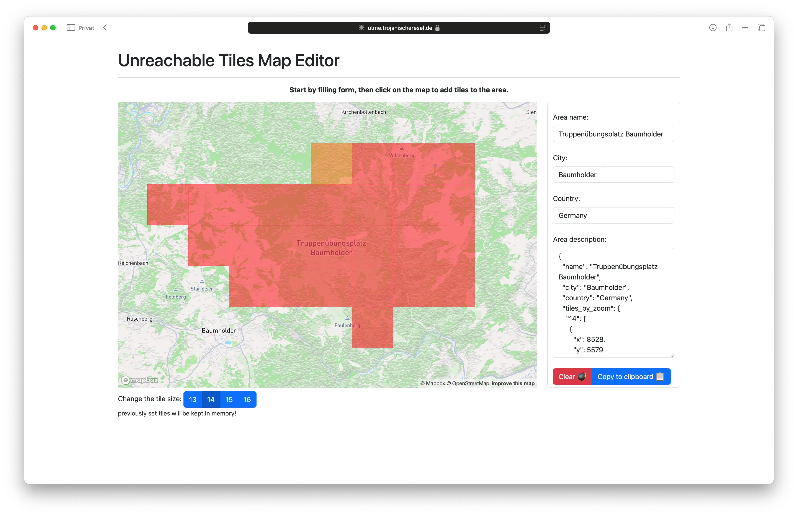

# Unreachable Tiles Map Editor

This is a simple map editor to track unreachable tiles on a map (mercator
projection).\
It is built with Deno and Oak, and uses Handlebars for templating.\
You will need a Mapbox API key to run this project.

> [!NOTE]\
> No tests were written for this project.\
> The main goal was to learn how to use [Deno](https://deno.com) (and
> [Oak](https://github.com/oakserver/oak)) and run on a VPS.\
> As the feature set is small, I decided to skip the tests for now.\
> Good enough software ships faster than perfect software. 🤙 #yoco



## Data format / JSON Schema

The json data for this project is a simple structure, with the bare minimum to
represent the unreachable tiles.

Supported tile zooms are 13, 14, 15, 16.

JSON Schema:

```json
{
  "name": String,
  "city": String,
  "country": String,
  "tiles_by_zoom": {
    "String zoom": [
      {
        "String x": Integer,
        "String y": Integer
      }
    ]
  }
}
```

Example:

```json
{
  "name": "Truppenübungsgelände Baumholder",
  "city": "Baumholder",
  "country": "Germany",
  "tiles_by_zoom": {
    "13": [
      {
        "x": 4262,
        "y": 2790
      }
    ]
  }
}
```

## Dependencies

<details>
<summary>Show Dependencies</summary>

- Deno v2

### Backend

- Oak v14 (because Deno docs suggested it - [hono🔥](https://hono.dev) has to
  wait)

### Frontend

- Handlebars v4
- Mapbox GL JS v3
- Bootstrap v5

</details>

## Run this project

<details>
<summary>Show instructions</summary>

You need to have a Mapbox API key to run this project. You can get one
[here](https://www.mapbox.com/).

Copy the `.env.init` file to `.env` and set the `MAPBOX_API_SECRET` variable
with your API key.

```bash
$ deno run --allow-net --allow-read --allow-env server.js
```

### Docker

Serve the project with Docker in --parallel mode. 🚀

```bash
$ docker build -t unreachable-tiles-map-editor .
$ docker run --rm -p 8000:8000 --env-file .env unreachable-tiles-map-editor
```

</details>

## Features

<details>
<summary>Show Features</summary>

- [x] Renders Mapbox map
- [x] Users can interact with the map, adding additional polygons of unreachable
      tiles
- [x] Edit unreachable tiles in multiple tile sizes
- [x] Render json data in a form
- [x] reset form and map
- [x] copy generated json data to clipboard

</details>

## Contributing

<details>
<summary>Show Contributing</summary>

### Suggest a new unreachable area

- suggest a new area of unreachable tiles (json format from the form)
- screenshot of the area
- short description of the area and some context

### Non-Technical Contributions

- Reporting a bug
- Discussing the current state of the code
- Submitting a fix
- Proposing new features
- Improving/adding documentation

### Technical Contributions

Feel free to contribute to this project. I suggest you to open an issue
describing the feature you want to implement or the bug you found and wait for
feedback before starting to code.

Forking this repository and submitting a pull request is the preferred way to
contribute.

#### Wishes

What I would love to add to this project:

- Adding a test suite 🥰 (Deno tests, for e2e I would prefer `playwright`)
- i18n support for Handlebars templates

</details>
